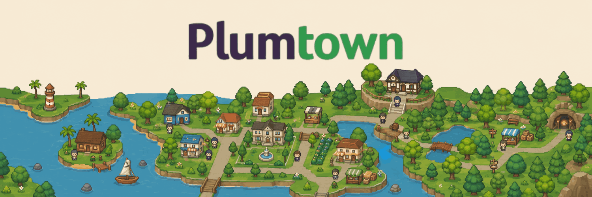

<div align="center">

# 🌳 Plumtown



### *Live a whole virtual life. Turn your milestones into real Solana.*

Plumtown is a cozy, browser-based **play-to-earn life simulator**. Raise a Sim, keep them happy, build a home, climb a career, fall in love, start a family — and every real milestone you hit mints **$PLUM** you can withdraw on-chain. Built from scratch with **vanilla JavaScript, HTML & CSS** — no frameworks, no build step, no front-end dependencies.

<br/>

[](https://playplumtown.com)
[](https://x.com/playPlumtown)


</div>

---

## ✨ Why Plumtown?

Most "play-to-earn" games are spreadsheets with a wallet button bolted on. Plumtown is a **real game first** — a deep, systems-driven life sim that's genuinely fun to play — with an **honest, non-custodial economy** layered on top. You don't grind a token; you live a life, and the rewards follow the story.

- 🎮 **A real life sim** — 8 needs, emotions, pathfinding, 12 skills, 10 careers, relationships, family generations.
- 🪙 **Two coins that make sense** — spend **₱ Plumbucks** in-game, earn **$PLUM** for verified achievements, cash out as real **SOL**.
- 🔒 **Non-custodial & server-verified** — you hold your own keys; the server caps rewards so it can't be botted or farmed.
- 🌍 **A shared neighbourhood** — visit other players' homes, see who's online, and chat — from the dashboard *or* while you play.
- 🎨 **Handmade pixel charm** — animated characters, a cosy theme, a procedural soundtrack, and a proper loading screen.
- ⚡ **Zero front-end dependencies** — pure HTML/CSS/JS. Open it in any modern browser.

---

## 📚 Table of Contents

- [How to Play](#-how-to-play)
- [Game Systems](#-game-systems)
- [The Economy](#-the-economy-plumbucks--plum--sol)
- [Multiplayer & Chat](#-multiplayer--chat)
- [Polish & Presentation](#-polish--presentation)
- [Tech Stack](#-tech-stack)
- [Run It Locally](#-run-it-locally)
- [Deploy the Shared World](#-deploy-the-shared-world-railway)
- [Turning On Real Payouts](#-turning-on-real-payouts)
- [Testing](#-testing)
- [Roadmap](#-roadmap)
- [Credits & License](#-credits--license)

---

## 🎮 How to Play

1. **Open the site** → click **Launch App** to enter your dashboard.
2. **Create a Sim** — pick their look (skin, hair, outfit), gender, a lifetime **aspiration**, and **3 personality traits** (each with real in-game effects).
3. **Hit Play** → enter the game. A starter home is furnished for you free.
4. **Live mode** — click furniture or use Quick Actions; your Sim **walks tile-by-tile** and uses it. Watch needs refill, moodlets pop, and the mood crystal change colour with their emotion.
5. **Build/Buy mode** — place, move and sell furniture, and restyle floors & walls. Furniture isn't cosmetic: it satisfies needs and raises home value.
6. **Get a job, grow skills, make friends, fall in love, raise a family.**
7. **Earn $PLUM** from your daily reward, quests, and one-time life milestones — then **withdraw** it as real SOL from the Wallet tab.

> Time runs continuously (pause / normal / fast / ultra) with day–night lighting. Toggle **Free Will** to let your Sim handle its own urgent needs.

---

## 🧠 Game Systems

Everything below is implemented and covered by the test suite.

| System | What it does |
|---|---|
| **8 Needs** | Hunger, Energy, Bladder, Hygiene, Social, Fun, Comfort & Room — each decays in real time at its own rate, modified by traits. Low energy triggers an exhaustion spiral. |
| **Emotions & Moodlets** | ~16 emotions (Happy, Energized, Inspired, Flirty, Bored, Tense, Exhausted…) chosen from needs + timed moodlets. Emotion scales work performance & learning, and tints the mood crystal. |
| **Pathfinding** | Grid **BFS** movement — the Sim walks to an object's use-tile, then performs the action. Re-routes if you build over the path; idle wandering when free. |
| **12 Skills** | Cooking, Handiness, Logic, Creativity, Charisma, Fitness, Programming, Gardening, Writing, Painting, Music, Athletic — XP curve, 10 levels, trait + mood multipliers. |
| **10 Careers** | Culinary, Tech, Science, Business, Athletic, Design, Music, Writing, Trades, Medical — 6 levels each, salary scaling, promotions gated by skill + mood. |
| **15 Traits** | Ambitious, Genius, Neat, Creative, Romantic, Bookworm, Glutton… each with **real mechanical effects** on decay, learning, mood, work and romance — shown right in the creator. |
| **Relationships** | NPCs you meet around town, **8 interactions** (chat → confess love), 6 tiers, charisma bonuses, romance gating, and decay over time if neglected. |
| **Build & Buy** | A full construction system: lay walls, cut doors, place 45+ pixel-art furniture pieces, and restyle floors & walls from real tile sheets. |
| **Sim Town** | A pixel neighbourhood with **10 venues** — Gym, Park, Cafe, Library, Mall, Club, School, Hospital, Restaurant, Beach — each a distinct lot with its own objects and people. |
| **Life & Family** | Sims age through life stages, move in → marry → try for baby, and children grow into new **playable Sims** (generations). |
| **Aspirations** | 5 lifetime goals (Wealth, Knowledge, Family, Creativity, Athletic) with real progress tracking and a big payout on completion. |
| **Quests** | 13 quests from "First Meal" to end-game goals like **Skill Master**, **Top of the Ladder** and **Dream Big**. |

---

## 💰 The Economy: Plumbucks → $PLUM → SOL

Plumtown runs **two currencies on purpose**, so the fun money and the real money never get confused:

### ₱ Plumbucks — the in-game money
Earned from **jobs** (a daily salary that scales with your career level + performance) and selling furniture. Spend it on furniture, build mode, floors & walls. It's your score and your pocket money — **not real money**.

### 🪙 $PLUM — the reward coin
Minted by *verified achievements*, all **deduplicated so they can't be farmed**:
- **Daily login** reward
- **Quest** completions
- One-time **life milestones** (first friend, first home, mastered skill, career peak, fulfilled aspiration…)

### 💸 Real SOL — the cash-out
Those verified achievements accrue **redeemable credits** — a capped, **server-authoritative** slice of $PLUM. Connect a **Phantom** wallet, prove it's yours with a free signature, and **Withdraw** → the backend pays real **SOL** straight to your wallet.

```
 play & live  ──►  hit a milestone  ──►  mint $PLUM  ──►  withdraw verified credits  ──►  real SOL
```

**Designed so it can't be drained:**

- 🛡️ **Server-authoritative** — the browser is never trusted with reward amounts. A tampered client mints nothing the server doesn't recognise.
- 🚧 **Capped** — daily earn caps, minimum withdrawals, daily withdrawal caps, and cooldowns.
- 🔑 **Non-custodial** — payouts go to *your* wallet; the operator never holds your funds. The treasury key lives only on the server.
- 🟣 **Solana mainnet** — real, on-chain SOL payouts, gated behind a master switch only you control.

---

## 🌍 Multiplayer & Chat

Plumtown plays great solo, and becomes a **shared neighbourhood** the moment you deploy the backend:

- 🏘️ **Visit real homes** — every player has their own house; browse the neighbourhood (live preview thumbnails) and **walk through** anyone's home.
- 🟢 **Live presence** — a stats bar shows how many **townies** there are, how many are **playing right now**, and the current **hotspot** venue. Each card shows where that player is.
- 💬 **Neighbourhood chat** — talk to everyone, from the **Community tab** *and* a floating **in-game chat widget** so you can chat while you play (with a live online count and unread badge).

Out of the box it runs offline with simulated neighbours so everything works with no server; point it at the backend and it becomes a real, shared world.

---

## 🎵 Polish & Presentation

- **Cosy handheld theme** — warm "paper" panels, a spinning crystal motif, chunky buttons, pixel-grass textures and animated bobbing townies.
- **Loading splash** — a branded Plumtown loading screen on the site.
- **Procedural soundtrack** — a warm, loungey jazz loop generated entirely in **Web Audio** (no audio files, no copyright), with an in-game 🎵 mute toggle.
- **Animated pixel characters** — 4-direction facing and a 6-frame walk cycle, with per-Sim variety.

---

## 🛠️ Tech Stack

| Layer | Stack |
|---|---|
| **Front-end** | Vanilla **JavaScript**, **HTML5**, **CSS3** — no framework, no build step, **zero dependencies**. Served by a tiny Node static server (`serve.js`). |
| **Game engine** | Modular IIFEs on `window.LifeSim` — state & save-migration, needs, skills, careers, relationships, build, movement (BFS), emotions, locations, life/family, clock & autonomy, FX. |
| **Backend** | A **zero-dependency Node** HTTP API — in-memory for local dev, **PostgreSQL** in production. Players, houses, rewards ledger, chat. |
| **Blockchain** | **Solana** payouts via `@solana/web3.js` (SOL or SPL/USDC), with `tweetnacl` signature verification. Lazy-loaded so the community backend runs without it. |
| **Tests** | `node test.js` — **110 functional assertions** across every system, no DOM needed. |

---

## 🚀 Run It Locally

```bash
# 1. Serve the game (any static server works; this one is included)
node serve.js
#    → http://localhost:8000/

# 2. (optional) run the shared-world backend in another terminal
cd server && npm install && node index.js
#    → LifeSim community API on :3001 (in-memory)

# 3. point the front-end at it (js/config.js)
#    window.LIFESIM_CONFIG = { cloudApi: 'http://localhost:3001' };
```

Open **http://localhost:8000/** and click **Launch App**. With no backend configured, it runs single-player with simulated neighbours.

---

## ☁️ Deploy the Shared World (Railway)

1. Push this repo to GitHub.
2. On [railway.app](https://railway.app): **New Project → Deploy from GitHub**, set the service **Root Directory** to `server`.
3. **New → Database → PostgreSQL** — Railway injects `DATABASE_URL`; the server auto-switches to Postgres.
4. Put the public URL into `js/config.js`:
   ```js
   window.LIFESIM_CONFIG = { cloudApi: 'https://your-app.up.railway.app' };
   ```

Now everyone who picks a name in the **Community** tab joins the **same world** — shared houses, live presence and chat. Full walkthrough in [`server/README.md`](server/README.md).

---

## 💎 Turning On Real Payouts

```bash
cd server && npm install              # adds the Solana libs
cp .env.example .env                  # set treasury key, network, asset
node scripts/verify-payout.js         # dry-run the payout path before funding the treasury
```

Set `P2E_SOLANA_NETWORK=mainnet-beta` + `P2E_PAYOUTS_ENABLED=true`, fund the treasury, and you're **live on Solana mainnet**. Everything is detailed (and safety-noted) in [`server/README.md`](server/README.md).

> ⚠️ **Real money = real responsibility.** Plumtown ships a *safe, bounded* payout mechanism, not legal advice. Real-money rewards can trigger gambling / money-transmission / securities / tax rules that vary by jurisdiction. Get a legal & security review before accepting real users.

---

## 🧪 Testing

```bash
node test.js
# === Results: 110 passed, 0 failed ===
```

Covers pathfinding, needs & emotions, skills/careers, relationships, build & rooms, life & family, the community layer, and the **server-side P2E reward & withdrawal rules** (the money-critical logic).

---

## 🗺️ Roadmap

- [x] Core life-sim engine — needs, skills, careers, build, family
- [x] Pixel-art world, animated characters, cosy theme
- [x] $PLUM economy, redeemable credits, non-custodial SOL payouts
- [x] Shared neighbourhood, live presence & chat (dashboard + in-game)
- [ ] Real-time co-presence (see players move in the same space live)
- [ ] Native mobile clients
- [ ] In-game marketplace & cosmetics sink

---

## 🎨 Credits & License

Pixel art from **LimeZu**'s *Modern Interiors* & *Modern Exteriors* packs ([limezu.itch.io](https://limezu.itch.io/)) — please support the artist and review their licence before redistributing raw tilesets. Music is generated procedurally in-app (no third-party audio).

Code released under the **MIT License**. Plumtown is an original project — play it, fork it, build on it. 🌳

<div align="center">

**[🌐 playplumtown.com](https://playplumtown.com) · [𝕏 @playPlumtown](https://x.com/playPlumtown)**

⭐ *If Plumtown made you smile, drop a star.*

</div>
